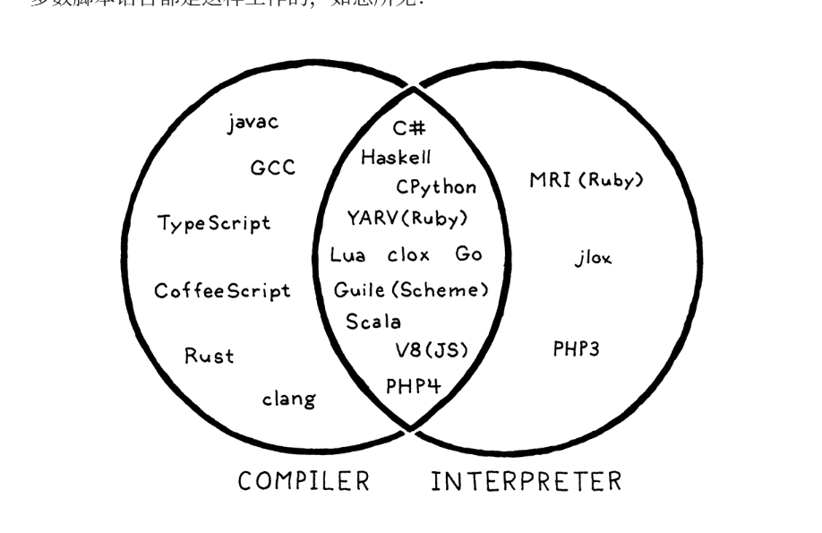

## 1. Pick an open source implementation of a language you like. Download the source code and poke around in it. Try to find the code that implements the scanner and parser. Are they handwritten, or generated using tools like Lex and Yacc? (.l or .y files usually imply the latter.)

TODO， lua.

## 2. Just-in-time compilation tends to be the fastest way to implement dynamically typed languages, but not all of them use it. What reasons are there to not JIT?

首先，compiler按方式分，静态编译器(static compiler), 比如C/C++编译器。解释器(Interpreter), Python的，JIT（Just-In Time ）在程序运行时，将部分代码编译成机器码，并缓存起来，提高执行效率，例如Java虚拟机(JVM) 中的JIT编译器. 动态语言为什么不都用 JIT ，这里有讨论： https://stackoverflow.com/questions/13689435/why-not-jitjust-in-time-compilers-everywhere。

另外还有一个编译器（Compilers one language to another）和解释器(where language to run)的概念区别

## 3. Most Lisp implementations that compile to C also contain an interpreter that lets them execute Lisp code on the fly as well. Why?

大多数 Lisp 都支持宏——在编译时执行的代码，因此实现需要能够在编译过程中评估宏本身。您可以通过编译宏然后运行它来做到这一点，但这会产生很大的开销。
